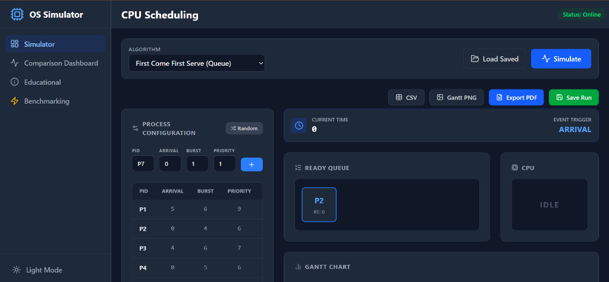
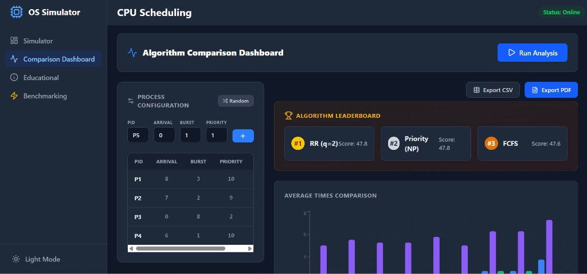
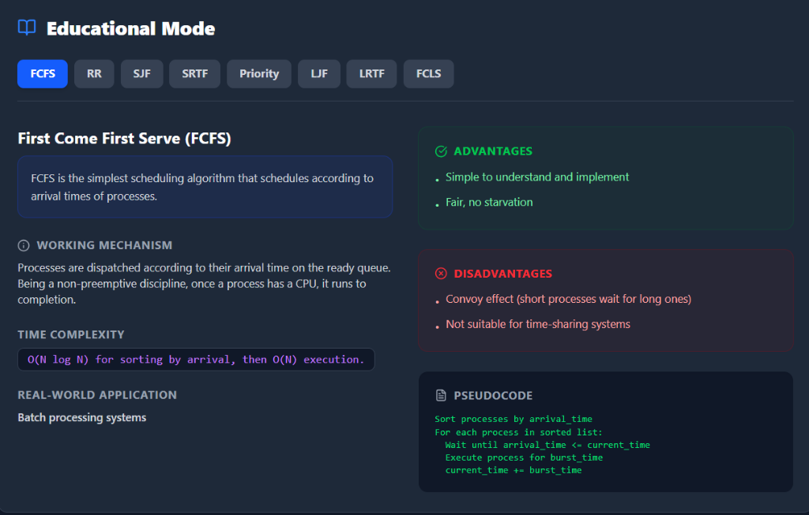
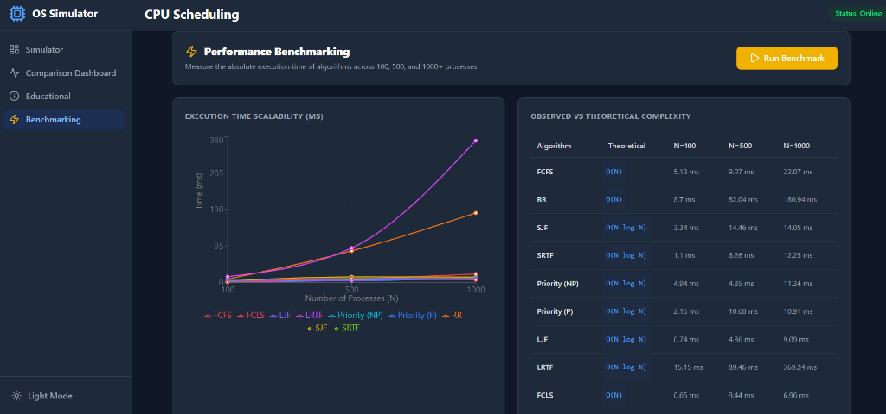

# CPU Scheduling Simulator & Visualizer

A highly interactive, full-stack web application designed to visualize and benchmark Operating System CPU Scheduling Algorithms. This tool goes beyond basic calculation by providing live timeline animations, detailed Gantt charts, advanced queue state tracking, and head-to-head algorithm benchmarking.

## 🚀 Features

- **Live Visualization**: Step-by-step playback of process execution, context switches, and queue states.
- **Multiple Algorithms Supported**: 
  - First Come First Served (FCFS)
  - Round Robin (RR)
  - Shortest Job First (SJF)
  - Shortest Remaining Time First (SRTF)
  - Priority Scheduling (Preemptive & Non-Preemptive)
  - Longest Job First (LJF)
  - Longest Remaining Time First (LRTF)
  - First Come Last Served (FCLS)
- **Advanced Data Structures**: See algorithms backed by real data structures (Min/Max Heaps for SJF/Priority, Circular Linked Lists for RR, Stacks for FCLS).
- **Comparison Dashboard**: Run all algorithms simultaneously and view a Radar Chart for Efficiency and a Line Chart for Context Switch overhead.
- **Performance Benchmarking**: Push the limits with datasets of 100, 500, and 1000 processes to observe empirical Big-O time complexity.
- **Export Ready**: Export simulation results and metrics to CSV, Gantt charts to PNG, and full reports to PDF.

## 🛠 Tech Stack

**Frontend**:
- React 19 (Vite)
- Tailwind CSS 4 (Styling & Animations)
- Recharts (Data Visualization)
- Framer Motion (Micro-animations)
- Lucide React (Icons)

**Backend**:
- Node.js & Express.js
- Custom Timeline Event Engine
- High-Performance Custom Data Structures (Heaps, CLL)

## 📦 Installation & Setup

1. **Clone the repository**
2. **Setup Backend**:
   ```bash
   cd backend
   npm install
   npm run dev
   ```
   The backend runs on `http://localhost:5000`.

3. **Setup Frontend**:
   ```bash
   cd frontend
   npm install
   npm run dev
   ```
   The frontend runs on `http://localhost:5173`.

## 🌐 Deployment

- **Frontend**: Configured for seamless deployment on Vercel (`vercel.json` included). Ensure you set `VITE_API_BASE_URL` to your production backend URL.
- **Backend**: Configured for Render via `render.yaml`. 

## 📸 Screenshots




## 📄 License
This project is open-source and developed for educational and demonstration purposes.
